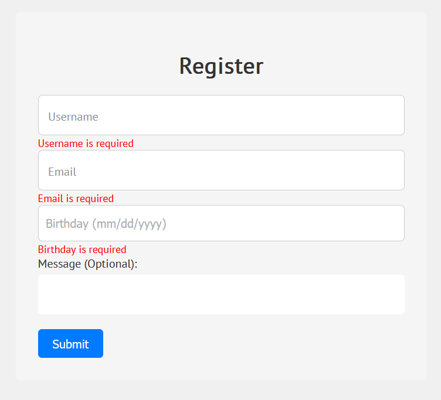

# registration-form

## Description
This PHP exercise involves creating a user registration form that captures user data. Upon submitting the form, users will be redirected to a page displaying the entered data. Notably, database usage is excluded in this exercise.

## Screenshots
  
Landing page

  
Sample of user input

  
Display results on submit (removes special characters)

  
Missing @ for email

  
Missing email domain (invalid)

  
Missing period after domain (invalid)

  
Date Picker for birthday (manual input of mm/dd/yyyy is supported)

  
Prevent empty fields on submit

  
Client Side Validation (no spaces and invalid date)

## Project Status

### User Name:
- Accepts all text input only; case-insensitive. ✅

### Email Address:
- Accepts only email-type input. ✅
- Incorrect email format highlighted in red on the next page. ✅
- Correct email format: some.string@domain.com. ✅

### Date of Birth:
- Accepts only date input. ✅
- Displays "you are a minor" if the user's age is below 18; otherwise, "you are not a minor." ✅
- Doesn't accept date input beyond today's date. ✅

### Message:
- Accepts any input type; case-insensitive. ✅
- Removes all special characters from user input on form submit and outputs the new message content. ✅

---

**Checklist:**
- [x] User Name
- [x] Email Address
- [x] Date of Birth
- [x] Message
